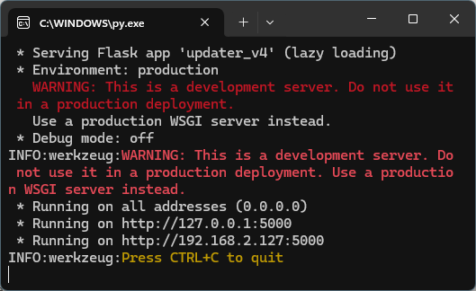

# Simple Score Overlay

## Installation:

1. Install Python 3, which can be downloaded from here: [https://www.python.org/downloads/](https://www.python.org/downloads/), overlay was tested with v3.8 and v3.13.2. During installation you will have an option to add Python to PATH (see the bottom checkbox on the screen), make sure you enable this option!
    
    
    
2. Unpack the archive into any folder. Avoid using Windows disk, as this may cause issues saving configuration files, unless you’re using your user folder. 
3. Go into the folder and run the install.bat file, this will install python libraries necessary for overlay server to run. Alternatively you can open the folder with the overlay files in Command Line prompt and run this command: 
    
    pip install -r req.txt
    
4. When the installation completes, double-click the updater_v4.py file. You will get a window like shown below. This is it, server is running and you can start setting up OBS. Do not close the window or select any text within it. Control Panel is available by opening [http://localhost:5000/](http://localhost:5000/) in any browser. If you have a mobile device that's on the same local network, scan the QR-code at the bottom of the main page to open the Control panel on your mobile device.

## Available browser sources:

**Scoreboard**

URL: [http://localhost:5000/scoreboard](http://localhost:5000/scoreboard)
Width: 1920px
Height: 200px

Displays the names of the teams, series score (non-numerical) and series type/game. Updated via scoreboard control panel. Has 3s fade-in upon turning on.

Designed to be displayed in the middle of the screen. The current layout is tailored to work with classic UT’s Omniview spec HUD.   

Series score is updated automatically by adding the results of individual maps. 

- **Series score:** Type of series (BO3/5/7) is set in the control panel. If Series type is set to 0, series score and type will both be hidden. The score and the game number is automatically updated based on the saved map results.
- **Team names:** updated based on the saved map results.

The distance between name blocks can be adjusted by editing “--score-names-gap” value at the beginning of the scoreboard_generic.html file. Vertical position of series type/game no can be adjusted by editing --series-top-offset value at the beginning of the scoreboard_generic.html file.

**Maps and bans results**

URL: [http://localhost:5000/map_results](http://localhost:5000/map_results)
Width: 1920px
Height: 200px

This overlay displays the map bans and previous results. Displays a box with the map name for each map ban and pick. If a result is saved for the specific map, this will show the result.  Assumes the teams do not change sides, Team A on the left, team B on the right. Has 3s fade-in upon turning on.

Designed to be displayed in the middle of the screen, will expand from center as more maps are played/added. The boxes are uniform size, can be larger if the map doesn’t fit. In that case consider either shortening the name of the map in the Maplist Editor or increasing the minimum box size in the Settings menu

The list of maps shown is solely controlled through the Bans menu
Score for specific map is controlled via saved results in scoreboard controls. Map name in the result must match exactly for the result to show up.

Settings (available in the Settings menu):

- **Gap between the boxes:** Horizontal distance between the boxes in pixels, by default set to 30px.
- **Minimum Box Width:** Minimum box width, by default set to 95px. Set this so that the longest map name fits.

**Schedule**

URL: [http://localhost:5000/schedule](http://localhost:5000/schedule)
Width: 1920px
Height: 1080px

Displays up to 4 upcoming games set in the Schedule editor within time specified in the settings, by default – next 12h. Each game will have the time listed for three timezones (CET, EST, MSK) and can be listed as specific matchup (e.g. “A vs B”), type of the game (e.g. “Semifinal”) or show both.

Page does not automatically refresh, so streaming software needs to be set to automatically reload the page on switching to the scene/source. Designed to be it’s own scene. 

Settings (available in the Settings menu):

- **Schedule Lookahead cut-off:** How far ahead the page should look at the schedule in hours.

**Countdown**

URL: [http://localhost:5000/next](http://localhost:5000/next)
Width: 1920px
Height: 1080px

Displays countdown to the next game scheduled within the next hour in the Schedule editor. When time runs out, countdown is replaced with “Starting soon” text. If the next game is more than 1hr away, just shows “Starting soon” without listing any match.

Page does not automatically refresh, so streaming software needs to be set to automatically reload the page on switching to the scene/source. Designed to be it’s own scene. 

## Control panel

- **Scoreboard Control**
Main overlay control panel
- **Bans**
Control panel for map bans/picks.
- **Map List Editor**
Simple maplist editor to be used in Bans and Scoreboard Control
- **Settings**
Several options for Maps and Bans results overlay and Stream Schedule scene.
- **Stream Schedule Editor**
Allows to list upcoming matches for the schedule countdown

Note that all controls are intended to be used on mobile device, hence the narrow vertical layout.

## Scoreboard control panel

This menu lets you define the team names for the scoreboard and control the series score. The series score is calculated automatically based on the saved results. You can also remove/update previous results if you need.

- **Top Navigation Bar**
    - **Home** - return back to main menu
    - **Maplist Editor** - quick access to map editor
    - **Bans** - quick access to bans menu
- **Series -** sets the type of series, BO3, BO5, BO7 or disabled. 
This option controls the number of score elements displayed by each team’s name and the type of series listed at the top of the Scoreboard overlay. When set to “Disabled” both will be hidden. Press **Update Match** to save the values and make overlay pick up the changes.

- **Map Pick** - currently not used
- **Match Number** - non-public facing. This defines a slot where the game result will be saved to using **Add Result**
- **Current Map** - lets you enter the map for the result. The field will have autocomplete suggestions from the map list made in **Map list Editor.** This name must match an entry in the Map list if you want the saved result to be picked up by **Map Results** overlay
- **Team/Player A** - left/red player/team name. Saved by clicking **Update Match**
- **Team/Player B** - right/blue player/team name. Saved by clicking **Update Match**
- **Team/Player A Score** - team/player’s score for a specific map result
- **Team/Player B Score** - team/player’s score for a specific map result
- **Results** - list of saved results. Each one can be deleted using the bin icon. The current game number at the top of the scoreboard uses this list to detect the current game.

This menu has two key workflows: updating the current game data and saving results of specific maps.

**Update match** button will save the values of all fields. The next time you open the menu it will use those saved fields and scoreboard will pick these values. Use this button to update series type and player/team names on the scoreboard. 

**Add Result** button will save values from **Current Map** and **Team A/B scores** into slot defined by **Match Number.** If there is already a result in this slot it will be overwritten. 

While you don’t need to click **Update match** before adding a map result, it’s recommended to do so to avoid losing data in case you reload the menu.

## Bans menu

**!! Uses map list prepared in the Map List Editor. Won’t work without it !!**

This menu controls which maps show up on the results overlay. The list is dynamically updated based on already played maps (these are the maps that have a saved result in the **Scoreboard Control**). 

**Ban buttons** - mark the specific map as banned by that team. On the map results overlay these maps will show up with “RED BAN”/“BLUE BAN” status.

**Pick buttons** - marks the specific map as picked by that team. These maps will show up on map results overlay with an empty status. When a result is added for that map in **Scoreboard Control Panel**, it will show up as status.

**Undo** - removes the last addition to ban list, can be done multiple times.

**Reset -** resets the ban/pick list. Note that this will not re-add maps that have a saved result in **Scoreboard Control Panel.**

Other controls:

- **Top Navigation Bar**
    - **Home** - return back to main menu
    - **Scoreboard** - quick access to Scoreboard Control Panel

## Map List Editor

Editor for the list of maps used for **Ban Menu** and autocomplete values for Current Map field in **Scoreboard Control Panel.**

Rather straightforward, enter the map name into the text field, click Add map. Remove entries by clicking the bin icons. Highly recommended to keep the names short.

Other controls:

- **Top Navigation Bar**
    - **Home** - return back to main menu
    - **Scoreboard** - quick access to Scoreboard Control Panel

## Stream Schedule Editor

Allows to add upcoming games for **Countdown** and **Schedule** overlays.

- **Team A/Team B -** participants’ names
- **Game Info** - additional game information, e.g. Seminfinal, 3rd place game, etc.
- **Time** - time picker. Use can use picker to set a date, time needs to be entered manually. This is your local time and it will be converted automatically. Note that even in AM/PM format time can be entered in 24 format.
- **Games** - list of scheduled games. Note that these are not removed automatically, you need to manually delete these entries using the bin icon.

You don’t have to provide the team names or game info to save an entry but this may break the schedule or upcoming screens. I highly recommend to provide at least Game Info if you don’t know the teams.
